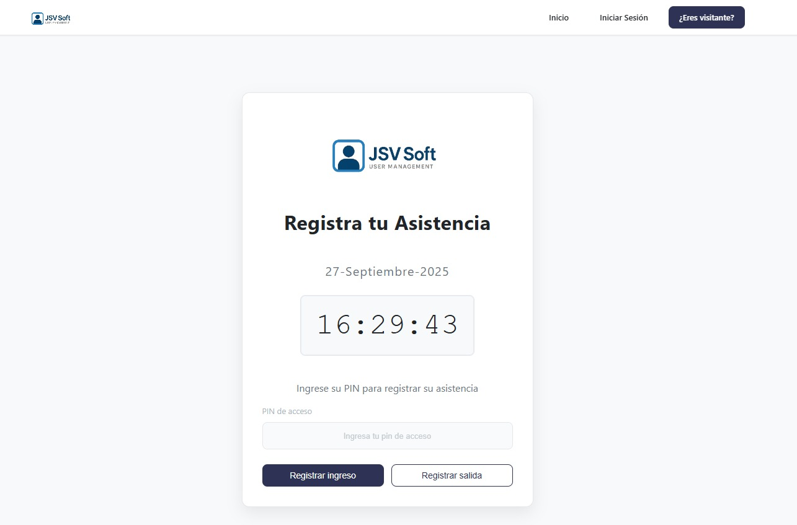

# JSV Soft - Sistema de Gestión de Usuarios



## Descripción

JSV Soft es un sistema integral de gestión de usuarios y control de asistencia desarrollado para la materia de Base de Datos de la Universidad IU Digital de Antioquia. La plataforma permite administrar empleados, registrar entradas y salidas mediante un sistema de PIN seguro, y generar reportes detallados.

## Características principales

- **Gestión de empleados**: Registro, edición y visualización de datos de empleados.
- **Control de asistencia**: Sistema de registro de ingreso y salida mediante PIN único.
- **Gestión de credenciales**: Activación/desactivación de credenciales de usuario.
- **Sistema de roles**: Administrador, Empleado y Visitante con diferentes permisos.
- **Panel administrativo**: Interfaz específica para gestión de empleados y visualización de reportes.
- **Reportes**: Generación de informes de asistencia y estadísticas de uso.

## Tecnologías utilizadas

- **Backend**: Python con Flask
- **Base de datos**: PostgreSQL
- **ORM**: SQLAlchemy
- **Frontend**: HTML, CSS, JavaScript
- **Autenticación**: Flask-Login
- **Formularios**: Flask-WTF
- **Tablas interactivas**: DataTables

## Estructura del proyecto

```
jsv-soft/
├── app/                    # Código principal de la aplicación
│   ├── forms/              # Formularios para el manejo de datos
│   ├── models/             # Modelos de la base de datos
│   ├── routers/            # Controladores de rutas
│   ├── static/             # Archivos estáticos (CSS, JS, imágenes)
│   ├── templates/          # Plantillas HTML
│   └── utils/              # Utilidades y funciones auxiliares
├── docs/                   # Documentación del proyecto
├── config.py               # Configuración de la aplicación
├── init_database.py        # Script para inicializar la base de datos
├── run.py                  # Punto de entrada de la aplicación
└── requirements.txt        # Dependencias del proyecto
```

## Autores

- Sergio Agudelo
- Esteban Bernal
- Valeria Ochoa

## Licencia

Este proyecto es de uso académico para la Universidad IU Digital de Antioquia.
